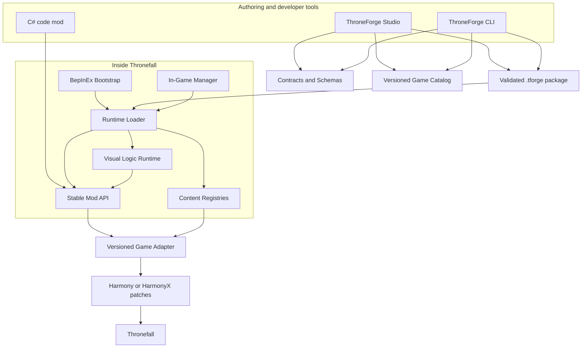

# ThroneForge
## Codex Master Specification for a Forge-like Thronefall Mod SDK

**Document status:** Draft 0.1  
**Target product:** ThroneForge (working title)  
**Target game:** Thronefall on PC/Steam, Windows-first  
**Primary implementation language:** C#  
**Authoring UI:** Avalonia desktop application  
**Prepared for:** OpenAI Codex and human maintainers  
**Research checkpoint:** 3 August 2026

---

## 0. How to use this specification

This document is the product and engineering source of truth. It is deliberately more detailed than `AGENTS.md` because Codex should receive short persistent repository rules from `AGENTS.md` and consult this file for architecture, behavior, formats, milestones, and acceptance criteria.

Place the files as follows:

```text
repository-root/
├── AGENTS.md
├── CODEX_START_PROMPT.md
└── docs/
    └── THRONEFORGE_SPEC.md
```

Start Codex from the repository root with the text in `CODEX_START_PROMPT.md`. Codex must create a living `PLAN.md` and `STATUS.md`, implement one milestone at a time, run validation after each milestone, and repair failures before proceeding.

### 0.1 Requirement language

The words **MUST**, **MUST NOT**, **SHOULD**, **SHOULD NOT**, and **MAY** are normative:

- **MUST / MUST NOT:** mandatory for the relevant release.
- **SHOULD / SHOULD NOT:** expected unless a documented architecture decision explains the exception.
- **MAY:** optional.

### 0.2 Critical rule: do not guess game internals

This specification defines a target architecture, not Thronefall's private API. Codex MUST NOT invent class names, methods, fields, scene names, internal IDs, asset paths, or lifecycle events. Those details must come from a legally obtained local game installation during the discovery milestone and must be documented with the exact game build fingerprint.

Any example such as `EnemySpawner`, `WaveManager`, or `base.enemy.light` is illustrative and must never be treated as a verified Thronefall identifier.

---

# 1. Product vision

ThroneForge is a community modding ecosystem for Thronefall with three layers:

1. A stable, game-specific runtime API that insulates mods from private game implementation details.
2. A deterministic data and package format for content mods.
3. A desktop visual editor that allows non-programmers to build useful mods without writing C#.

The product should feel closer to a small game-development kit than a loose collection of Harmony patches. The user should be able to create a custom enemy wave in a visual editor, validate it, package it, install it into a profile, launch the game, and see the wave run without hand-editing JSON or compiling a DLL.

## 1.1 Problem statement

Existing game mods commonly patch private methods directly. This creates several problems:

- every mod repeats reflection and patching logic;
- game updates break many mods independently;
- IDs and object references are undocumented;
- dependency and load-order behavior is inconsistent;
- settings are fragmented;
- non-programmers cannot participate;
- users cannot reliably diagnose compatibility failures;
- code mods execute with full process privileges but are rarely distinguished from harmless data mods.

ThroneForge addresses these problems through a versioned adapter, a stable public API, validated package formats, centralized diagnostics, and no-code tooling.

## 1.2 Product goals

ThroneForge MUST:

- load and validate ThroneForge mod packages;
- provide deterministic dependency resolution and load order;
- expose stable lifecycle events and content registries;
- isolate game-specific reflection and Harmony patches inside a versioned adapter;
- support data-only content mods without compiling or executing arbitrary code;
- support C# code mods as a separate, explicitly trusted category;
- provide a visual Studio application for building and validating content mods;
- provide an in-game manager for profiles, status, configuration, and diagnostics;
- support schema and content migrations;
- provide actionable compatibility and validation errors;
- provide automated test infrastructure that does not require the proprietary game in normal CI;
- make a custom-wave mod the first complete vertical slice.

## 1.3 Success criteria for the first public MVP

The MVP is successful when a new user can complete this flow:

```text
Install ThroneForge
→ Open ThroneForge Studio
→ Create a “Custom Wave” project
→ Select enemies from the exported game catalog
→ Arrange spawns on a timeline
→ See validation errors immediately
→ Build a .tforge package
→ Install it into a profile
→ Launch Thronefall through ThroneForge
→ Observe the wave in the selected level/night
→ Export a diagnostic bundle if it fails
```

The same package MUST also be buildable through the CLI from source files.

## 1.4 Non-goals for the MVP

The first MVP MUST NOT attempt to provide:

- multiplayer or network synchronization;
- arbitrary new 3D models, shaders, or complex asset-bundle pipelines;
- a complete map editor;
- a replacement for Steam, Thunderstore, or r2modman;
- a public mod marketplace with accounts and payments;
- a secure sandbox for arbitrary C# plugins;
- automatic compatibility with every Thronefall build;
- a full visual scripting language before custom waves work end to end;
- support for consoles or mobile platforms;
- binary patching of the original game on disk.

---

# 2. Assumptions, unknowns, and release gates

## 2.1 Verified feasibility signals

Public Thronefall mods and an archived multiplayer experiment demonstrate that BepInEx-based runtime injection has been used successfully for Thronefall. Public projects differ on BepInEx major version, so the exact current loader and target framework MUST be confirmed against the user's installed build rather than copied blindly.

The project should assume that game updates can change internals. Thronefall has received renewed update activity, so adapter isolation and version fingerprints are core requirements rather than optional polish.

## 2.2 Unknowns that MUST be resolved in Milestone M1

M1 must determine and document:

- current Thronefall executable architecture;
- Unity version;
- scripting backend: Mono or IL2CPP;
- compatible BepInEx distribution and exact pinned build;
- target framework required by the runtime plugin;
- Harmony/HarmonyX compatibility;
- game build identifier and file fingerprints;
- the minimum stable hook needed to detect game startup and level/night lifecycle;
- the internal representation of enemies and wave scheduling;
- whether runtime content can be registered cleanly or must be translated into existing game structures;
- whether in-game UI should use existing UI systems, Unity UI, IMGUI, or a minimal overlay;
- available modding policy, EULA constraints, and contact path for the rights holder.

## 2.3 Platform policy

- **MVP runtime:** Windows x64.
- **Studio and CLI:** Windows first; architecture should remain portable to Linux and macOS.
- **Linux game runtime:** not promised for MVP. It MAY be investigated after Windows stability.
- **External tools:** target the pinned current .NET LTS selected during bootstrap. At the research checkpoint, .NET 10 is the active LTS; the game-facing runtime projects may require a different target based on BepInEx and Unity compatibility.

## 2.4 Legal and distribution gate

Before public release, maintainers MUST review the current game EULA and modding policy and should request written clarification from the current rights holder. ThroneForge MUST NOT distribute:

- original game assemblies;
- copied game assets;
- decompiled source files;
- a modified game executable;
- proprietary metadata beyond minimal non-copyrightable identifiers required for compatibility, subject to legal review.

Development scripts may copy references from the user's own installation into a local ignored directory. Those files MUST be excluded from Git and release artifacts.

The name “ThroneForge” is a working title. Trademark and naming review is a release gate.

---

# 3. User personas and core workflows

## 3.1 No-code creator

A player with no programming experience wants to create custom waves and balancing variants.

Needs:

- project templates;
- searchable game catalog;
- timeline editor;
- descriptive form controls instead of raw JSON;
- immediate validation;
- one-click build, install, and launch;
- undo/redo and safe autosave;
- clear explanations rather than stack traces.

## 3.2 Low-code creator

A technically curious creator wants triggers, conditions, timers, variables, and actions without C#.

Needs:

- typed node graph;
- context-aware node palette;
- cycle and type validation;
- execution tracing;
- reusable graph fragments later;
- deterministic runtime limits.

This persona is served after the custom-wave MVP.

## 3.3 C# mod developer

An experienced developer wants stable events, services, registries, version contracts, examples, and a test harness.

Needs:

- public API assemblies without private game types;
- documented thread and lifecycle rules;
- semantic versioning;
- compatibility checks;
- templates and examples;
- integration test fixtures;
- clear distinction between public API and adapter internals.

## 3.4 Player and modpack user

A player wants to install mods, enable a profile, resolve dependencies, configure mods, launch safely, and understand failures.

Needs:

- profile isolation;
- dependency and conflict messages;
- safe mode;
- code-mod warnings;
- version status;
- support bundle export;
- rollback after a failed launch.

## 3.5 ThroneForge maintainer

A maintainer needs to update only the adapter after most game updates, reproduce reports, publish compatibility profiles, and protect public contracts.

Needs:

- build fingerprints;
- binding reports;
- adapter smoke tests;
- fixture catalogs;
- compatibility matrix;
- schema migration tests;
- deterministic release process.

---

# 4. Product components

| Component | Purpose | Runs where |
|---|---|---|
| ThroneForge Bootstrap | Entry point loaded by BepInEx; starts diagnostics and runtime | Inside Thronefall |
| ThroneForge Runtime | Mod discovery, validation, dependency resolution, profiles, lifecycle | Inside Thronefall |
| ThroneForge API | Stable interfaces and events for code mods | Shared/runtime |
| ThroneForge Content | Registries and data-to-runtime translation | Shared/runtime |
| ThroneForge Logic | Typed graph model, validation, and interpreter | Shared/runtime/Studio |
| ThroneForge Game Adapter | All private game integration and patches | Inside Thronefall |
| ThroneForge Packaging | `.tforge` creation, extraction, validation, hashing | Shared |
| ThroneForge Schemas | JSON schemas and migrations | Shared |
| ThroneForge CLI | Create, validate, build, install, diagnose | External process |
| ThroneForge Studio | No-code/low-code desktop authoring application | External process |
| ThroneForge In-Game UI | Mod status, profile, settings, diagnostics | Inside Thronefall |
| ThroneForge TestKit | Fixtures, fake adapter, sample catalog, integration harness | Tests/developer tools |

---

# 5. Architecture principles

## 5.1 Stable core, replaceable edge

Game internals are volatile. The adapter is replaceable. Contracts, package formats, validation, and user projects should be stable.

```text
Mods / Studio / CLI
        ↓
Stable contracts, schemas and services
        ↓
Versioned Thronefall adapter
        ↓
Private game classes and Harmony patches
```

## 5.2 Single source of truth

A serialized definition MUST be represented by one canonical contract and one validator used by:

- Studio;
- CLI;
- package builder;
- runtime loader;
- tests;
- documentation examples.

The UI MUST NOT implement a separate interpretation of the schema.

## 5.3 Explicit compatibility boundaries

Every public contract has a schema/API version. Every adapter supports explicit game fingerprints. Unsupported versions must fail clearly, not continue optimistically.

## 5.4 Data before code

The preferred mod format is declarative content. C# plugins are an advanced escape hatch, not the default extension mechanism.

## 5.5 Deterministic behavior

Given the same enabled packages, profile, configuration, catalog, and game fingerprint, ThroneForge should produce the same load order and validation result.

## 5.6 No false security claims

Data-only packages can be constrained. Arbitrary .NET plugins cannot be safely sandboxed in the same game process. The UI must communicate this difference accurately.

## 5.7 Observable failure

Every failed operation needs:

- stable error code;
- human-readable message;
- technical context in logs;
- suggested remediation when possible;
- correlation identifier for support bundles.

---

# 6. System architecture



---

# 7. Repository and solution structure

The final repository should converge on this structure. Codex may introduce projects incrementally by milestone, but project names and boundaries should remain consistent.

```text
ThroneForge/
├── AGENTS.md
├── CODEX_START_PROMPT.md
├── PLAN.md
├── STATUS.md
├── CHANGELOG.md
├── Directory.Build.props
├── Directory.Packages.props
├── global.json
├── ThroneForge.slnx
│
├── src/
│   ├── ThroneForge.Contracts/
│   ├── ThroneForge.Schemas/
│   ├── ThroneForge.API/
│   ├── ThroneForge.Packaging/
│   ├── ThroneForge.Diagnostics/
│   ├── ThroneForge.Content/
│   ├── ThroneForge.Logic/
│   ├── ThroneForge.Runtime/
│   ├── ThroneForge.GameAdapter.Abstractions/
│   ├── ThroneForge.GameAdapter.Thronefall/
│   ├── ThroneForge.Bootstrap.Thronefall/
│   ├── ThroneForge.Cli/
│   ├── ThroneForge.Studio/
│   ├── ThroneForge.InGameUI/
│   └── ThroneForge.TestKit/
│
├── tests/
│   ├── ThroneForge.ArchitectureTests/
│   ├── ThroneForge.Contracts.Tests/
│   ├── ThroneForge.Schemas.Tests/
│   ├── ThroneForge.Packaging.Tests/
│   ├── ThroneForge.Runtime.Tests/
│   ├── ThroneForge.Logic.Tests/
│   ├── ThroneForge.GameAdapter.Tests/
│   ├── ThroneForge.Cli.Tests/
│   └── ThroneForge.Studio.Tests/
│
├── schemas/
│   ├── manifest/
│   ├── content/
│   ├── logic/
│   └── config/
│
├── templates/
│   ├── content-wave/
│   └── code-mod/
│
├── examples/
│   ├── GoblinRush/
│   └── ExampleCodeMod/
│
├── docs/
│   ├── THRONEFORGE_SPEC.md
│   ├── architecture/
│   ├── adr/
│   ├── discovery/
│   ├── formats/
│   ├── api/
│   ├── testing/
│   └── user-guide/
│
├── fixtures/
│   ├── catalogs/
│   ├── packages/
│   ├── version-profiles/
│   └── corrupted-packages/
│
├── eng/
│   ├── scripts/
│   └── release/
│
└── artifacts/                 # ignored build output
```

## 7.1 Target framework policy

External tools SHOULD target the pinned current .NET LTS selected in `global.json`. Game-facing projects MUST target the framework compatible with the detected Thronefall scripting backend and selected BepInEx build.

The solution may therefore use multiple target frameworks. Shared contracts may multi-target only when needed. Do not force modern runtime dependencies into the injected plugin.

A required M1 ADR must record:

- detected backend;
- selected BepInEx build;
- game-facing target framework;
- external-tool target framework;
- compatibility consequences.

## 7.2 Dependency direction

Allowed high-level dependency direction. In the diagram below, `A ← B` means that **B may reference A**:

```text
Contracts ← Schemas
Contracts + Schemas ← Packaging
Contracts ← API
Contracts ← Diagnostics
Contracts + Schemas ← Content
Contracts + Schemas ← Logic

Contracts + Schemas + Packaging + Diagnostics + Content + Logic + GameAdapter.Abstractions ← Runtime
API + Content + Runtime + Diagnostics + GameAdapter.Abstractions ← GameAdapter.Thronefall
Runtime + GameAdapter.Thronefall + Diagnostics ← Bootstrap.Thronefall
Contracts + Schemas + Packaging + Content + Logic + Diagnostics ← CLI
Contracts + Schemas + Packaging + Content + Logic + Diagnostics ← Studio
Runtime + Diagnostics ← InGameUI
```

Forbidden dependencies include:

- Contracts → Unity/BepInEx/Harmony/Avalonia;
- Schemas → Unity/BepInEx/Harmony/Avalonia;
- Studio domain/view models → Thronefall assemblies;
- CLI → Thronefall assemblies;
- Runtime core → concrete Thronefall private types;
- ordinary mods → adapter internals.

Architecture tests MUST enforce these rules by inspecting project references and assembly references.

---

# 8. Module specifications

## 8.1 `ThroneForge.Contracts`

Purpose: immutable or validation-friendly data contracts shared across tools and runtime.

Contains:

- `ModId`, `ContentId`, `ProfileId`, `NodeId` value objects;
- semantic version and version-range wrappers;
- manifest models;
- package metadata;
- content references;
- validation issue model;
- compatibility status model;
- error codes;
- localization keys;
- portable DTOs.

Rules:

- no I/O;
- no Unity types;
- no JSON library attributes unless a deliberate serialization decision is recorded;
- equality and string normalization must be deterministic;
- public IDs must be immutable;
- exceptions should be reserved for programmer errors; validation returns structured issues.

## 8.2 `ThroneForge.Schemas`

Purpose: schema loading, validation orchestration, migrations, and schema metadata.

Contains:

- JSON Schema 2020-12 resources;
- schema registry by `$id` and version;
- migration interfaces;
- migration planner;
- validation facade;
- schema-to-form metadata extraction.

Rules:

- schemas are embedded for runtime use and copied as files for authoring/documentation;
- every schema change requires fixtures and migration tests;
- schema version and package version are independent;
- unknown properties should be rejected in stable sections unless explicitly designed as extension points.

## 8.3 `ThroneForge.API`

Purpose: public programmatic surface for C# mods.

Contains:

- lifecycle event interfaces;
- content registry interfaces;
- game service abstractions;
- configuration access;
- logging facade;
- main-thread dispatcher abstraction;
- mod context and lifecycle;
- capability discovery.

Rules:

- never expose private game objects;
- prefer handles and immutable snapshots;
- event subscriptions return `IDisposable` or equivalent tokens;
- callbacks must document thread and lifetime;
- public API compatibility follows semantic versioning;
- experimental APIs use a clearly named namespace and are not covered by normal stability promises.

## 8.4 `ThroneForge.Packaging`

Purpose: safe creation and reading of `.tforge` archives.

Contains:

- package builder;
- package reader;
- manifest extraction;
- path validation;
- hash calculation;
- deterministic archive creation;
- install transaction staging;
- package integrity report.

Rules:

- reject absolute paths, `..`, device paths, alternate data streams, symlinks, and path normalization escapes;
- set size, file-count, compression-ratio, and JSON-depth limits;
- content packages cannot contain `.dll`, `.exe`, scripts, or native libraries;
- extraction occurs into a staging directory and commits atomically;
- build output is reproducible where archive tooling allows.

## 8.5 `ThroneForge.Diagnostics`

Purpose: structured logging, support bundles, error catalog, and health reports.

Contains:

- event IDs and error codes;
- JSONL and human-readable log sinks;
- correlation IDs;
- redaction rules;
- support bundle builder;
- environment and compatibility report;
- crash marker handling.

Rules:

- never log secrets or full personal filesystem paths by default;
- user names in paths should be redacted in support bundles;
- stack traces go to technical logs, not primary UI messages;
- support bundles list included files before export.

## 8.6 `ThroneForge.Content`

Purpose: portable content definitions, registry behavior, conflict handling, and catalog references.

MVP scope:

- wave definitions;
- spawn groups;
- triggers and conditions required for waves;
- localization entries;
- config definitions.

Later scope:

- perks;
- buildings;
- units;
- loot;
- game rules;
- asset references.

Rules:

- content definitions remain free of game types;
- registries have explicit duplicate and override policy;
- all references resolve through namespaced IDs;
- unresolved references are validation errors unless explicitly optional;
- runtime translation is performed through adapter capabilities.

## 8.7 `ThroneForge.Logic`

Purpose: typed low-code graph model and deterministic interpreter.

MVP: contracts and validation may exist, but the visual graph editor is deferred.

Contains later:

- node definitions;
- typed ports;
- graph serializer;
- graph validator;
- execution planner;
- bounded interpreter;
- trace events;
- built-in triggers, conditions, values, and actions.

Rules:

- no arbitrary code evaluation;
- no C# scripting, JavaScript, expression compilation, reflection calls, or template execution;
- graphs have hard execution limits;
- node types are versioned;
- code mods may register new node types only through explicit trusted extension interfaces.

## 8.8 `ThroneForge.Runtime`

Purpose: runtime orchestration independent of concrete Thronefall internals.

Contains:

- mod discovery;
- profile loading;
- package validation;
- dependency resolver;
- load-order planner;
- lifecycle state machine;
- compatibility service;
- safe mode;
- crash recovery;
- content activation;
- code-mod activation coordination.

Rules:

- dependency resolution is deterministic;
- cyclic required dependencies fail the affected set;
- a failed mod should not corrupt the profile state;
- runtime startup phases are explicit and logged;
- the runtime can be tested against `ThroneForge.TestKit` without the game.

## 8.9 `ThroneForge.GameAdapter.Abstractions`

Purpose: interfaces between stable runtime and game-specific implementation.

Minimum interfaces:

```csharp
public interface IGameAdapter
{
    GameFingerprint Fingerprint { get; }
    AdapterCompatibility Compatibility { get; }
    AdapterCapabilities Capabilities { get; }

    Task InitializeAsync(CancellationToken cancellationToken);
    Task ShutdownAsync(CancellationToken cancellationToken);
}

public interface IGameCatalogProvider
{
    Task<GameCatalog> ExportAsync(CancellationToken cancellationToken);
}

public interface IWaveRuntimeBridge
{
    WaveValidationResult ValidateForRuntime(WaveDefinition definition);
    Task<WaveHandle> RegisterAsync(
        WaveDefinition definition,
        CancellationToken cancellationToken);
}

public interface IGameLifecycleSource
{
    IDisposable Subscribe(IGameLifecycleObserver observer);
}
```

Exact method signatures may evolve during M2, but the concepts and separation are mandatory.

## 8.10 `ThroneForge.GameAdapter.Thronefall`

Purpose: all Thronefall-specific discovery, bindings, patches, object translation, and version profiles.

Contains:

- binding definitions;
- reflection resolver;
- Harmony/HarmonyX patches;
- game version profiles;
- runtime capability probes;
- catalog exporter;
- wave bridge;
- UI integration bridge;
- adapter diagnostics.

Rules:

- no other first-party project may duplicate Thronefall reflection names;
- binding resolution must return a report containing resolved, ambiguous, and missing members;
- patch targets must be guarded by version/capability checks;
- adapter startup must fail safely before activating mods when critical bindings are missing;
- internal objects must be converted to portable snapshots before leaving the adapter boundary.

## 8.11 `ThroneForge.Bootstrap.Thronefall`

Purpose: smallest possible BepInEx entry point.

Responsibilities:

- initialize early logging;
- determine paths;
- calculate fingerprint inputs;
- construct adapter and runtime;
- start runtime lifecycle;
- register shutdown cleanup;
- display a minimal fatal-error path if startup fails.

It MUST NOT contain content logic, dependency resolution, or large UI implementations.

## 8.12 `ThroneForge.Cli`

Purpose: deterministic command-line interface for creators, CI, maintainers, and support.

The CLI must work without Thronefall for schema and package operations. Commands requiring a game installation must state that requirement and accept an explicit game path or configured installation.

## 8.13 `ThroneForge.Studio`

Purpose: external no-code/low-code authoring environment.

Architecture:

- Avalonia views;
- MVVM or equivalent strict UI/domain separation;
- shared domain and validation services;
- command-based editing for undo/redo;
- background validation with cancellation;
- no direct game assembly references.

## 8.14 `ThroneForge.InGameUI`

Purpose: focused runtime manager, not a full authoring tool.

Responsibilities:

- show enabled/disabled mods;
- show compatibility and dependency status;
- edit generated settings;
- show restart requirements;
- select profiles before launch where feasible;
- export logs/support bundle;
- warn clearly about code mods.

## 8.15 `ThroneForge.TestKit`

Purpose: allow most development and testing without proprietary game files.

Contains:

- fake adapter;
- deterministic clock;
- fake lifecycle source;
- sample game catalog;
- package fixture builder;
- invalid/corrupt package corpus;
- graph execution harness;
- runtime scenario DSL if useful.

---

# 9. Mod categories and trust model

## 9.1 Content mod

A content mod contains only validated data and approved assets.

Allowed MVP content:

- manifest;
- wave JSON;
- localization JSON;
- configuration schema;
- icon and approved small media types.

Disallowed:

- assemblies;
- scripts;
- native libraries;
- executables;
- command files;
- arbitrary expressions;
- network endpoints that the runtime calls automatically.

Trust label: **Data-only**.

## 9.2 Logic mod

A logic mod adds validated node graphs using built-in node types. It remains data-only as long as it does not ship trusted extensions.

Trust label: **Data-only logic**.

## 9.3 Code mod

A code mod contains a .NET assembly loaded into the game process.

Capabilities may include:

- new mechanics;
- custom AI;
- custom node types;
- advanced UI;
- deep runtime changes.

Trust label: **Full-trust code**.

The manager MUST require an explicit user decision before enabling newly installed code mods. The warning must explain that code mods run with the same operating-system access as the game process.

---

# 10. `.tforge` package format

A `.tforge` file is a ZIP-compatible archive with stricter validation rules.

## 10.1 Package layout

```text
GoblinRush.tforge
├── manifest.json
├── content/
│   └── waves/
│       └── goblin-rush.json
├── logic/
│   └── night-three.graph.json       # optional, post-MVP
├── localization/
│   ├── de-DE.json
│   └── en-US.json
├── config/
│   └── config.schema.json
├── assets/
│   └── icon.png
└── integrity.json
```

`manifest.json` MUST be at the archive root. File names inside the archive use forward slashes and normalized lowercase extensions.

## 10.2 Manifest example

```json
{
  "$schema": "https://schemas.throneforge.dev/manifest/v1.json",
  "schemaVersion": 1,
  "id": "dev.chris.goblin-rush",
  "name": "Goblin Rush",
  "version": "0.1.0",
  "authors": [
    {
      "name": "Chris"
    }
  ],
  "description": "Adds a configurable enemy wave to night three.",
  "license": "MIT",
  "type": "content",
  "game": {
    "id": "thronefall",
    "version": "*"
  },
  "sdk": {
    "version": ">=0.1.0 <0.2.0"
  },
  "dependencies": [],
  "optionalDependencies": [],
  "conflicts": [],
  "permissions": [],
  "content": {
    "waves": [
      "content/waves/goblin-rush.json"
    ]
  },
  "localization": {
    "defaultLocale": "en-US",
    "files": {
      "en-US": "localization/en-US.json",
      "de-DE": "localization/de-DE.json"
    }
  },
  "configuration": {
    "schema": "config/config.schema.json"
  }
}
```

## 10.3 Identifier rules

`ModId` and `ContentId` MUST:

- be lowercase ASCII;
- contain 3 to 64 characters;
- start with a letter or digit;
- use only letters, digits, `.`, `_`, and `-`;
- be globally namespaced by convention, preferably reverse-domain or platform/user namespace;
- remain stable after publication.

Recommended pattern:

```regex
^[a-z0-9][a-z0-9._-]{2,63}$
```

Content IDs SHOULD include the mod ID:

```text
dev.chris.goblin-rush.wave.main
```

## 10.4 Integrity file

`integrity.json` should list a SHA-256 digest and size for every package file except itself.

```json
{
  "algorithm": "sha256",
  "files": {
    "manifest.json": {
      "size": 842,
      "hash": "..."
    },
    "content/waves/goblin-rush.json": {
      "size": 1280,
      "hash": "..."
    }
  }
}
```

MVP integrity protects against accidental corruption. Repository signatures and publisher identity are post-MVP features.

## 10.5 Deterministic build rules

The package builder SHOULD:

- sort paths ordinally;
- normalize JSON with stable property ordering where controlled;
- use UTF-8 without BOM;
- normalize line endings to LF inside JSON and text assets;
- avoid embedding local absolute paths;
- set a deterministic archive timestamp or documented fixed policy;
- produce the same hashes for identical source inputs.

## 10.6 Safety limits

Initial defaults, configurable only by maintainers:

| Limit | Initial value |
|---|---:|
| Maximum package size | 100 MiB |
| Maximum extracted size | 250 MiB |
| Maximum files | 2,000 |
| Maximum single JSON file | 5 MiB |
| Maximum JSON nesting depth | 64 |
| Maximum path length inside archive | 240 characters |
| Maximum compression ratio | 100:1 |

These values are starting points and must be load-tested before release.

---

# 11. Manifest dependency model

Each dependency entry contains:

```json
{
  "id": "dev.example.shared-content",
  "version": ">=1.2.0 <2.0.0",
  "reason": "Provides shared wave definitions."
}
```

Resolution rules:

1. Required dependencies must be installed, enabled, and version-compatible.
2. Optional dependencies may add capabilities but cannot make the base mod fail when absent.
3. Conflicts block activation when both mods are enabled.
4. The dependency graph is topologically sorted.
5. Ties are broken by normalized mod ID for deterministic output.
6. Required dependency cycles disable all members of the cycle and produce a single grouped error plus per-mod status.
7. User-defined load-order overrides are not part of the MVP. Explicit dependency edges are preferred.
8. Override/patch content requires an explicit declaration rather than relying on incidental load order.

---

# 12. Game catalog

The game catalog is a portable snapshot exported by the adapter for Studio and CLI.

## 12.1 Purpose

It allows tools to present verified selectable entities without loading proprietary assemblies.

Catalog entries may include:

- stable ThroneForge catalog ID;
- adapter binding key;
- display name or localization key;
- category;
- tags;
- read-only numeric metadata useful for authoring;
- thumbnail reference only when legally distributable or generated by the user;
- game fingerprint;
- catalog schema version.

## 12.2 Catalog example

```json
{
  "$schema": "https://schemas.throneforge.dev/catalog/v1.json",
  "schemaVersion": 1,
  "game": "thronefall",
  "fingerprint": "steam-win64-<build>-<hash-prefix>",
  "generatedAtUtc": "2026-08-03T12:00:00Z",
  "entities": [
    {
      "id": "game.enemy.example-light",
      "kind": "enemy",
      "displayName": "Example Light Enemy",
      "bindingKey": "adapter-specific-key",
      "tags": ["light", "melee"]
    }
  ]
}
```

The example entity is fictional. The real exporter must derive entries from the installed game.

## 12.3 Catalog compatibility

A project records the catalog fingerprint used for authoring. On build or runtime validation:

- exact fingerprint match: green;
- compatible adapter profile with all references resolved: green with informational notice;
- changed metadata but all references resolved: yellow warning;
- missing references: red error;
- unknown game build: adapter compatibility error before content activation.

---

# 13. Custom wave content model

Custom waves are the first vertical slice.

## 13.1 Design goals

The wave model must support:

- level or game-mode target;
- start trigger;
- timeline-based spawn groups;
- enemy references from the catalog;
- count and interval;
- optional spawn lane or spawn point when supported by the adapter;
- simple conditions;
- configurable numeric values;
- deterministic validation;
- graceful capability errors when a field is unsupported by a game build.

## 13.2 Wave example

```json
{
  "$schema": "https://schemas.throneforge.dev/content/wave/v1.json",
  "schemaVersion": 1,
  "id": "dev.chris.goblin-rush.wave.main",
  "displayName": {
    "key": "wave.goblinRush.name",
    "fallback": "Goblin Rush"
  },
  "target": {
    "mode": "campaign",
    "level": "catalog.level.example",
    "night": 3
  },
  "trigger": {
    "type": "night-started"
  },
  "timeline": [
    {
      "id": "spawn-001",
      "atSeconds": 0.0,
      "spawn": {
        "enemy": "game.enemy.example-light",
        "count": 12,
        "intervalSeconds": 0.25
      }
    },
    {
      "id": "spawn-002",
      "atSeconds": 20.0,
      "spawn": {
        "enemy": "game.enemy.example-heavy",
        "count": 2,
        "intervalSeconds": 1.0
      }
    }
  ],
  "completion": {
    "type": "all-spawned-enemies-defeated"
  }
}
```

All catalog IDs above are placeholders.

## 13.3 Validation rules

Wave validation MUST include:

- valid schema and IDs;
- unique timeline item IDs;
- nonnegative finite timestamps;
- positive bounded counts;
- finite intervals in allowed range;
- target compatibility;
- every enemy reference resolves;
- no unsupported adapter capabilities;
- localized display text has fallback;
- timeline items sorted or normalized deterministically;
- configured limits cannot produce unreasonable spawn volume;
- optional warnings for likely balance problems.

Balance warnings must not block building unless they violate hard runtime limits.

## 13.4 Initial runtime limits

Starting values for MVP testing:

- maximum timeline entries per wave: 1,000;
- maximum enemies requested by one entry: 500;
- maximum total enemies requested by one wave: 5,000;
- maximum timeline duration: 3,600 seconds;
- minimum spawn interval: 0.01 seconds unless adapter batches spawns safely.

These are protective defaults, not gameplay recommendations.

## 13.5 Override policy

MVP custom waves should be additive whenever possible. Replacing native waves is higher risk and should be deferred or require an explicit override declaration:

```json
{
  "override": {
    "target": "game.wave.some-verified-id",
    "mode": "replace",
    "priority": 100
  }
}
```

Conflicting replacements must fail deterministically unless a later formal conflict-resolution mechanism is implemented.

---

# 14. Configuration schema and generated UI

Mods describe settings with JSON Schema 2020-12 plus a limited ThroneForge UI annotation vocabulary.

## 14.1 Example

```json
{
  "$schema": "https://json-schema.org/draft/2020-12/schema",
  "$id": "https://mods.example/dev.chris.goblin-rush/config/v1.json",
  "title": "Goblin Rush",
  "type": "object",
  "additionalProperties": false,
  "properties": {
    "difficulty": {
      "title": "Difficulty",
      "type": "string",
      "enum": ["easy", "normal", "hard"],
      "default": "normal",
      "x-throneforge-ui": {
        "control": "select",
        "order": 10
      }
    },
    "extraEnemies": {
      "title": "Additional enemies",
      "type": "integer",
      "minimum": 0,
      "maximum": 50,
      "default": 0,
      "x-throneforge-ui": {
        "control": "slider",
        "step": 1,
        "order": 20
      }
    }
  },
  "required": ["difficulty", "extraEnemies"]
}
```

## 14.2 Supported MVP controls

| Schema shape | Generated control |
|---|---|
| boolean | checkbox/toggle |
| string + enum | dropdown |
| integer/number with min/max | number box; slider when annotated |
| unconstrained string | text box |
| color annotation | color picker |
| catalog-reference annotation | searchable entity selector |

Unsupported schema constructs must still be validated but may fall back to a raw structured editor in Studio. The in-game manager should show only supported safe controls and a clear message for unsupported forms.

## 14.3 Settings storage

Settings are stored per profile and mod ID, outside the package:

```text
profiles/<profile-id>/config/<mod-id>.json
```

Rules:

- packages are immutable after installation;
- configuration changes are atomic;
- invalid configuration cannot replace the last valid file;
- migrations create backups;
- defaults are materialized predictably;
- a mod reads settings through its context, not arbitrary paths.

---

# 15. Visual logic graph

The graph system is post-MVP but its data model should not conflict with early architecture.

## 15.1 Node categories

- **Trigger:** night started, level loaded, enemy defeated, timer elapsed.
- **Condition:** numeric comparison, boolean logic, reference exists, random chance with deterministic seed policy.
- **Value:** constants, event fields, configuration value, player state snapshot.
- **Action:** start wave, wait, grant supported resource, show localized message, enable content.
- **Flow:** sequence, branch, bounded repeat.

## 15.2 Typed ports

Every port declares a portable type:

- flow;
- boolean;
- integer;
- number;
- string;
- duration;
- entity reference;
- wave reference;
- event payload type.

Connections with incompatible types are invalid. Implicit conversions should be minimal and documented.

## 15.3 Graph example

```json
{
  "$schema": "https://schemas.throneforge.dev/logic/graph/v1.json",
  "schemaVersion": 1,
  "id": "dev.chris.goblin-rush.logic.night-three",
  "nodes": [
    {
      "id": "n1",
      "type": "event.night-started",
      "version": 1,
      "position": { "x": 80, "y": 120 },
      "inputs": {}
    },
    {
      "id": "n2",
      "type": "condition.integer-greater-or-equal",
      "version": 1,
      "position": { "x": 340, "y": 120 },
      "inputs": {
        "right": 3
      }
    },
    {
      "id": "n3",
      "type": "action.start-wave",
      "version": 1,
      "position": { "x": 620, "y": 80 },
      "inputs": {
        "wave": "dev.chris.goblin-rush.wave.main"
      }
    }
  ],
  "connections": [
    {
      "from": { "node": "n1", "port": "flow" },
      "to": { "node": "n2", "port": "flow" }
    },
    {
      "from": { "node": "n1", "port": "night" },
      "to": { "node": "n2", "port": "left" }
    },
    {
      "from": { "node": "n2", "port": "true" },
      "to": { "node": "n3", "port": "flow" }
    }
  ]
}
```

## 15.4 Runtime safety limits

The interpreter MUST enforce limits such as:

- maximum nodes per graph;
- maximum connections;
- maximum execution steps per event;
- maximum active timers per mod;
- maximum nested call depth;
- no unbounded loops;
- bounded repeats only;
- cancellation on level unload or mod disable;
- execution time budget with diagnostics.

Default limits must be tested under worst-case fixture graphs.

---

# 16. Public C# mod API

## 16.1 Lifecycle

A code mod should implement an explicit lifecycle interface rather than rely solely on constructor side effects.

```csharp
public interface IThroneForgeMod
{
    ValueTask InitializeAsync(
        IModContext context,
        CancellationToken cancellationToken);

    ValueTask ShutdownAsync(CancellationToken cancellationToken);
}
```

`IModContext` may expose:

```csharp
public interface IModContext
{
    ModIdentity Identity { get; }
    IModLogger Log { get; }
    IGameEvents Events { get; }
    IContentRegistry Content { get; }
    IModConfiguration Configuration { get; }
    IMainThreadDispatcher MainThread { get; }
    ICapabilityService Capabilities { get; }
}
```

## 16.2 Event model

Initial event concepts:

- runtime initialized;
- main menu reached;
- level loading/loaded/unloading;
- day started;
- night started;
- wave started/completed;
- enemy spawned/defeated;
- run completed/failed.

Only events verified by the adapter may be exposed. Event payloads use portable snapshots and stable IDs.

## 16.3 Thread model

The API MUST document:

- which callbacks run on Unity's main thread;
- which services require main-thread access;
- whether event handlers are synchronous or async;
- timeout and exception behavior;
- cleanup behavior during unload.

Default policy:

- game lifecycle and content callbacks run on the main thread;
- expensive work should be moved off-thread by the mod;
- game interactions return to the main thread through `IMainThreadDispatcher`;
- one mod's exception is caught, logged, and associated with that mod;
- repeated failures may quarantine the mod for the session.

## 16.4 Example code mod

```csharp
public sealed class ExampleMod : IThroneForgeMod
{
    private IDisposable? _subscription;

    public ValueTask InitializeAsync(
        IModContext context,
        CancellationToken cancellationToken)
    {
        _subscription = context.Events.NightStarted.Subscribe(evt =>
        {
            context.Log.Info(
                "Night {NightNumber} started in {LevelId}.",
                evt.NightNumber,
                evt.LevelId);
        });

        return ValueTask.CompletedTask;
    }

    public ValueTask ShutdownAsync(CancellationToken cancellationToken)
    {
        _subscription?.Dispose();
        return ValueTask.CompletedTask;
    }
}
```

The final API may use a different event abstraction, but deterministic subscription cleanup is mandatory.

## 16.5 API stability

- `ThroneForge.API` follows semantic versioning.
- Removing or changing a public member requires a major version.
- Additive changes require a minor version.
- Bug fixes require a patch version.
- Obsolete members should remain for at least one minor release when practical.
- Adapter version changes do not automatically require an API major version.
- Public serialization contracts have separate schema versions and migrations.

---

# 17. Game adapter design

## 17.1 Fingerprint

A `GameFingerprint` should include enough information to identify compatibility without storing whole proprietary files:

```text
platform
store/channel
executable architecture
Unity version
scripting backend
game product version
Steam build ID when available
selected assembly/file SHA-256 prefixes
adapter profile ID
```

Hashes should be calculated locally. Reports may include full hashes in local logs and shortened hashes in UI.

## 17.2 Version profile

Example structure:

```json
{
  "profileId": "thronefall-steam-win64-example",
  "game": "thronefall",
  "platform": "windows-x64",
  "backend": "mono",
  "productVersion": "unverified-example",
  "fingerprints": {
    "assemblyCSharpSha256": "..."
  },
  "bindings": {
    "lifecycle.nightStarted": {
      "type": "verified-type-name",
      "method": "verified-method-name",
      "signature": "verified-signature"
    }
  }
}
```

No real profile may be committed until values are verified from a local installation and legal review permits the metadata.

## 17.3 Binding resolution

Bindings should be resolved through a layered strategy:

1. exact known profile match;
2. exact type/member signatures for compatible builds;
3. carefully constrained structural fallback when explicitly allowed;
4. otherwise fail unsupported.

Structural fallback must never mean broad “find any similar method and patch it.” It must require strong predicates and produce a warning that is visible in diagnostics.

## 17.4 Adapter compatibility states

```text
Supported
SupportedWithWarnings
UnknownBuild
MissingCriticalBindings
PartiallySupported
UnsupportedBackend
InitializationFailed
```

Content activation is allowed only in supported states defined by policy. Unknown builds default to no activation until a user explicitly enables an experimental mode; experimental mode is not required for MVP.

## 17.5 Patch policy

- Use the smallest number of patches needed.
- Prefer prefixes/postfixes over transpilers.
- Transpilers require dedicated fixture tests and signature checks.
- Every patch has a stable patch ID and documented target reason.
- Patch application is idempotent.
- Failed critical patches abort runtime activation.
- Unpatch on shutdown where supported and safe.
- Ordinary mods must not patch private game methods through the public API.

## 17.6 Catalog exporter

The exporter must:

- run only after the required game systems are initialized;
- map private objects to portable catalog entries;
- avoid writing copied assets;
- produce deterministic ordering;
- include fingerprint and schema version;
- validate its own output;
- support a CLI or runtime command to export to a user-selected path.

---

# 18. Runtime loader and profile system

## 18.1 Startup phases

```text
0. Early diagnostics
1. Path and installation validation
2. Game fingerprint calculation
3. Adapter selection and binding verification
4. Profile selection
5. Package discovery
6. Manifest and integrity validation
7. Dependency/conflict resolution
8. Configuration validation/migration
9. Content registration
10. Code-mod trust checks and activation
11. Runtime ready
```

Each phase emits start, success, failure, duration, and correlation data.

## 18.2 Mod states

```text
Discovered
InvalidPackage
Disabled
BlockedByDependency
BlockedByConflict
IncompatibleGame
IncompatibleSdk
Ready
Loading
Loaded
Failed
Quarantined
RestartRequired
```

The in-game manager and CLI use the same status model.

## 18.3 Profiles

A profile contains:

```text
profiles/<profile-id>/
├── profile.json
├── enabled.json
├── config/
├── state/
├── logs/
└── crash-marker.json          # only after abnormal startup/session
```

A profile MUST NOT modify package files. It references installed immutable package versions.

## 18.4 Safe mode and crash recovery

On startup, the runtime writes a session marker. On clean shutdown, it removes or completes the marker. If the next launch detects an incomplete marker, it offers safe mode.

Safe mode behavior:

- disable all third-party code mods;
- optionally disable all non-core mods;
- retain the original profile state for restoration;
- produce a recovery report;
- allow selective re-enabling after a successful launch.

MVP may implement a conservative command-line/profile flag before polished UI.

## 18.5 Transactional installation

Install flow:

1. copy package to staging;
2. validate archive safety;
3. validate manifest and integrity;
4. calculate package hash;
5. extract or store package under content-addressed/versioned path;
6. write installation metadata;
7. atomically update package index;
8. clean staging.

A failed installation leaves the previous installation and profile unchanged.

---

# 19. ThroneForge Studio UX specification

## 19.1 Main layout

```text
┌────────────────────────────────────────────────────────────────────┐
│ File  Edit  Project  Build  Test  Help                            │
├────────────────┬────────────────────────────────┬──────────────────┤
│ PROJECT        │ EDITOR                         │ PROPERTIES       │
│                │                                │                  │
│ ▾ Waves        │ Night 3 timeline               │ Enemy           │
│   Goblin Rush  │ 0s────10s────20s────30s        │ [Search...   ▼]  │
│ ▾ Logic        │ [12 light]     [2 heavy]        │ Count [12]       │
│ ▾ Localization │                                │ Interval [0.25]  │
│ ▾ Configuration│                                │                  │
├────────────────┴────────────────────────────────┴──────────────────┤
│ Problems: 0 errors, 1 warning  | Catalog: compatible | Saved       │
└────────────────────────────────────────────────────────────────────┘
```

## 19.2 Project wizard

MVP templates:

- Custom Wave;
- Empty Content Mod;
- Existing Project from Folder.

Wizard fields:

- project name;
- mod ID;
- author;
- version;
- target catalog;
- output directory;
- default locale.

Validation occurs before project creation. The wizard generates a valid, buildable project with one example wave that is disabled or clearly marked as sample content.

## 19.3 Wave timeline editor

Required interactions:

- add spawn entry;
- choose verified enemy from catalog;
- drag entry in time;
- edit exact time numerically;
- edit count and interval;
- duplicate/delete;
- multi-select where feasible;
- zoom and pan timeline;
- snap settings;
- keyboard accessible operations;
- undo/redo;
- validation markers on entries;
- summary of total enemies and duration.

The underlying data model must not depend on screen coordinates. Timeline positions derive from `atSeconds`.

## 19.4 Properties panel

The properties panel renders editors from the selected portable model and schema metadata. It must:

- validate on change with debounce;
- show field-level messages;
- preserve user input when temporarily invalid;
- commit valid values through undoable commands;
- show capability restrictions from the selected catalog/adapter profile.

## 19.5 Catalog browser

Features:

- full-text search;
- kind filters;
- tag filters;
- detail preview;
- compatibility status;
- favorites/recent items later;
- no direct dependency on game assemblies.

## 19.6 Problems panel

Every issue shows:

- severity;
- error code;
- file/content item;
- field path;
- message;
- suggested fix;
- click-to-navigate action.

## 19.7 Build, install, and launch

Commands:

- Validate Project;
- Build Package;
- Install to Profile;
- Build and Install;
- Launch Thronefall with Profile;
- Open Logs;
- Export Support Bundle.

Launch must never silently modify the default unmodded profile. The UI should display the selected profile prominently.

## 19.8 Persistence and recovery

- autosave recovery data separately from project files;
- prompt to recover after a crash;
- use atomic file replacement;
- maintain recent project list;
- never write inside the game installation except through explicit installation/runtime setup operations.

## 19.9 Accessibility and localization

- keyboard navigation for all core actions;
- visible focus;
- screen-reader labels for form controls;
- adequate contrast;
- UI strings in resource files;
- English as initial default; German translation may ship with MVP;
- locale-independent numeric serialization.

---

# 20. In-game manager specification

## 20.1 Scope

The in-game UI is deliberately smaller than Studio.

Required pages:

1. Mods
2. Mod details
3. Configuration
4. Compatibility/diagnostics
5. About/version

## 20.2 Mods page

Each row shows:

- enabled state;
- name and version;
- content/code trust badge;
- compatibility state;
- dependency/conflict indicator;
- restart requirement.

## 20.3 Configuration page

- generated from the same configuration schema used by Studio;
- validates before save;
- marks settings that require restart;
- supports reset to defaults;
- does not expose unsupported complex schema controls as if editable.

## 20.4 Code-mod warning

Before enabling a new code mod, show a modal that states in plain language:

- it contains executable code;
- it runs inside the game process;
- it may access files/network according to operating-system permissions;
- ThroneForge cannot guarantee that arbitrary code is safe;
- only trusted sources should be enabled.

The decision and package hash are recorded in the profile trust store.

## 20.5 Restart behavior

MVP should assume enabling/disabling packages requires restart unless a component is proven unload-safe. The UI must avoid promising hot reload.

---

# 21. CLI specification

Executable name: `tforge`.

## 21.1 Commands

```text
tforge new wave <directory>
tforge validate <project-or-package>
tforge build <project-directory> --output <path>
tforge pack <source-directory> --output <path>
tforge inspect <package>
tforge install <package> --profile <id>
tforge uninstall <mod-id> --version <version>
tforge list [--profile <id>]
tforge profile create <id>
tforge profile validate <id>
tforge catalog export --game-path <path> --output <file>
tforge doctor [--game-path <path>]
tforge support-bundle --profile <id> --output <file>
```

## 21.2 Output modes

- human-readable default;
- `--json` for automation;
- no ANSI when redirected or `--no-color`;
- stable exit codes.

## 21.3 Initial exit codes

| Code | Meaning |
|---:|---|
| 0 | success |
| 1 | unexpected internal error |
| 2 | invalid arguments |
| 3 | validation failed |
| 4 | dependency/conflict failure |
| 5 | incompatible game/SDK |
| 6 | I/O or permission failure |
| 7 | unsafe or corrupt package |
| 8 | game installation required/not found |

## 21.4 Example validation output

```text
ERROR TF-WAVE-004 content/waves/goblin-rush.json#/timeline/1/spawn/enemy
Enemy reference 'game.enemy.missing' does not exist in catalog
'steam-win64-<fingerprint>'. Select a valid enemy or export a newer catalog.

Validation failed: 1 error, 0 warnings.
```

---

# 22. Error model and diagnostics

## 22.1 Error code format

```text
TF-<AREA>-<NUMBER>
```

Areas:

- `PKG` package;
- `MAN` manifest;
- `DEP` dependency;
- `CFG` configuration;
- `WAVE` wave content;
- `LOGIC` graph;
- `CAT` catalog;
- `ADP` adapter;
- `BIND` binding;
- `PATCH` patching;
- `RUN` runtime;
- `UI` UI;
- `SEC` security.

Examples:

| Code | Meaning |
|---|---|
| TF-PKG-001 | archive path escapes package root |
| TF-PKG-006 | package exceeds extraction limit |
| TF-MAN-003 | invalid mod ID |
| TF-DEP-002 | required dependency missing |
| TF-DEP-005 | dependency cycle |
| TF-WAVE-004 | enemy reference unresolved |
| TF-ADP-001 | unsupported game fingerprint |
| TF-BIND-003 | critical binding missing |
| TF-PATCH-002 | critical patch failed |
| TF-SEC-004 | executable found in content package |

## 22.2 Structured log event

```json
{
  "timestampUtc": "2026-08-03T12:34:56.789Z",
  "level": "Error",
  "eventId": "TF-BIND-003",
  "correlationId": "01J...",
  "component": "GameAdapter.Thronefall",
  "modId": null,
  "message": "Critical binding could not be resolved.",
  "properties": {
    "binding": "lifecycle.nightStarted",
    "profile": "thronefall-steam-win64-example"
  },
  "exception": null
}
```

## 22.3 Support bundle

A support bundle may include:

- ThroneForge versions;
- game fingerprint, not game files;
- active profile manifest;
- package IDs, versions, and hashes;
- compatibility report;
- validation report;
- sanitized logs;
- crash marker;
- relevant configuration after user confirmation;
- operating-system and runtime summary.

It must exclude:

- game binaries;
- copied assets;
- authentication tokens;
- unrelated personal files;
- full user name/path where redaction is possible.

---

# 23. Security requirements

## 23.1 Package extraction

The reader MUST defend against:

- ZIP Slip/path traversal;
- absolute and device paths;
- alternate data streams;
- symbolic links and reparse points;
- case-collision problems on Windows;
- decompression bombs;
- excessive file count;
- oversized JSON;
- malformed UTF-8;
- duplicate archive entries;
- filename normalization ambiguity.

## 23.2 Data parsing

- use bounded JSON depth;
- reject non-finite numbers;
- reject duplicate properties when the serializer supports detection;
- use explicit polymorphic type registries, never arbitrary type names;
- do not enable unsafe deserialization features;
- validate before constructing runtime objects;
- preserve original validation location for diagnostics.

## 23.3 Graph runtime

- no arbitrary code;
- no reflection nodes;
- no file/process/network nodes in built-in data-only logic;
- bounded execution;
- cancellation on lifecycle change;
- per-mod quotas;
- deterministic random source when randomness is exposed.

## 23.4 Code mods

- load only after package integrity and trust confirmation;
- display hash and source metadata;
- log loaded assembly identities;
- isolate dependency resolution as much as practical with load contexts where supported, while explicitly not claiming security isolation;
- require restart to unload unless proven safe;
- allow safe mode to disable all third-party code.

## 23.5 Network policy

Core runtime, Studio, and CLI should be functional offline. No package or telemetry request is sent without a documented feature and user control. Automatic update checks, repositories, and analytics are post-MVP decisions.

---

# 24. Testing and quality strategy

## 24.1 Test layers

### Unit tests

- IDs and normalization;
- version range behavior;
- schema validation;
- migration planning;
- dependency resolution;
- load-order determinism;
- path safety;
- package hashing;
- wave validation;
- graph validation/interpreter;
- support-bundle redaction.

### Property-based/fuzz tests

Recommended for:

- archive paths;
- dependency graphs;
- malformed manifests;
- JSON depth/size boundaries;
- graph cycles and execution limits;
- Unicode and case-normalization edge cases.

### Golden/snapshot tests

- canonical package structure;
- CLI JSON output;
- validation diagnostics;
- schema examples;
- catalog export shape;
- migrations.

Snapshots must be reviewed intentionally, not updated automatically on failure.

### Integration tests without game

Using `ThroneForge.TestKit`:

- complete package discovery and load plan;
- profile activation;
- content registration through fake adapter;
- safe-mode recovery;
- configuration migration;
- wave lifecycle simulation.

### Game smoke tests

Performed against a clean local profile and documented game fingerprint:

1. BepInEx loads bootstrap.
2. Runtime reaches ready state with no third-party mods.
3. Catalog exports.
4. Example package validates and installs.
5. Target level loads.
6. Custom wave activates once at expected trigger.
7. Save/profile remains usable.
8. Clean shutdown removes crash marker.
9. Unmodded launch remains available.

Game smoke tests must not run in public CI without a lawful private setup.

### UI tests

- view-model tests for editing commands;
- undo/redo tests;
- validation navigation;
- project open/save recovery;
- generated config controls;
- basic automated UI smoke test where Avalonia tooling supports it;
- manual visual QA checklist for release candidates.

## 24.2 Architecture tests

Architecture tests are mandatory from M0. They must fail if:

- core assemblies reference Unity, BepInEx, Harmony, or game assemblies;
- Studio or CLI references the concrete game adapter;
- adapter implementation leaks into public API;
- forbidden project-reference direction appears.

## 24.3 Performance budgets

Initial targets on a typical desktop, measured after implementation:

- package discovery of 100 small mods: under 500 ms excluding disk cold-start variability;
- dependency resolution for 500 mods: under 100 ms;
- project validation after a small edit: perceived response under 200 ms through incremental/background validation;
- runtime startup overhead excluding BepInEx/game startup: target under 2 seconds for 100 small content mods;
- no recurring per-frame allocations from idle ThroneForge systems in release build where measurable.

These are targets to benchmark, not claims.

---

# 25. Implementation roadmap and acceptance criteria

## M0 - Repository bootstrap and architecture skeleton

### Deliverables

- solution and project skeleton;
- `global.json` using current LTS for external tooling;
- centralized build properties and package versions;
- nullable, analyzers, deterministic build, warnings as errors;
- initial `AGENTS.md`, `PLAN.md`, `STATUS.md`, `CHANGELOG.md`;
- architecture decision records;
- architecture tests;
- CI that restores, builds, tests, and verifies formatting;
- placeholder interfaces with no invented game internals.

### Required ADRs

- ADR-0001: stable core and adapter boundary;
- ADR-0002: target-framework split pending M1 discovery;
- ADR-0003: `.tforge` as constrained ZIP package;
- ADR-0004: JSON Schema 2020-12 and shared validation;
- ADR-0005: data-only vs full-trust code mods.

### Acceptance criteria

- clean clone builds with no game installation;
- architecture tests prove forbidden references are absent;
- no Unity/BepInEx/Harmony package is referenced outside placeholder game-facing projects;
- all required validation commands pass;
- `STATUS.md` identifies M1 as next and lists unknowns honestly.

## M1 - Thronefall discovery spike

### Deliverables

- local discovery script that accepts explicit game path;
- backend and architecture detection;
- game fingerprint report;
- selected/pinned BepInEx setup documented;
- minimal hello-world bootstrap verified in clean profile;
- lifecycle hook proof for one verified event;
- first adapter binding report;
- catalog feasibility proof for at least one entity category;
- legal/distribution checklist.

### Discovery checklist

- inspect executable directory layout;
- detect `GameAssembly.dll`/IL2CPP data versus managed `Assembly-CSharp.dll` layout;
- record Unity version from local metadata;
- verify loader with a clean installation/profile;
- capture sanitized log;
- identify exact entry point and target framework;
- document every discovered private member with evidence and fingerprint;
- do not commit copied assemblies;
- create ignored `lib/game/<fingerprint>/` or equivalent local reference path;
- verify unmodded launch remains possible.

### Acceptance criteria

- `docs/discovery/<fingerprint>.md` exists;
- no fictional private API names remain in executable code;
- bootstrap loads and logs exact fingerprint;
- one lifecycle event is observed reliably;
- selected BepInEx/runtime choice is recorded in ADR;
- all proprietary files are ignored and absent from Git history.

## M2 - Contracts, schemas, validation, and fixtures

### Deliverables

- value objects and manifest contracts;
- JSON Schema registry;
- manifest v1 schema;
- wave v1 schema;
- configuration schema support;
- structured validation issues;
- sample catalog fixture;
- valid and invalid fixture corpus;
- migration interfaces;
- documentation generated or synchronized with examples.

### Acceptance criteria

- all examples in this specification validate after replacing placeholder catalog IDs with fixtures;
- invalid fixtures fail with stable error codes and JSON paths;
- Studio, CLI, and runtime can call one validation facade;
- serialization round trips are deterministic;
- schema tests cover boundaries and unknown properties.

## M3 - Packaging, installation transactions, profiles, and dependency resolution

### Deliverables

- safe `.tforge` reader/builder;
- integrity file;
- path and decompression protections;
- package index;
- immutable installation layout;
- profiles;
- dependency/conflict resolver;
- safe-mode marker foundation;
- CLI `inspect`, `validate`, `pack`, `install`, and `list` foundations.

### Acceptance criteria

- malicious archive fixtures are rejected;
- failed install leaves prior state unchanged;
- repeated build from identical source is reproducible within documented archive constraints;
- dependency order is deterministic;
- missing, incompatible, conflicting, and cyclic dependencies have exact tests;
- content packages containing executable files are rejected.

## M4 - Adapter and custom-wave runtime vertical slice

### Deliverables

- verified game version profile;
- adapter startup and binding report;
- lifecycle source needed by waves;
- catalog exporter for required enemy/level identifiers;
- wave bridge;
- content registry;
- example `GoblinRush` package;
- clean-profile game smoke test.

### Acceptance criteria

- exported catalog validates;
- example wave package builds through shared packaging;
- runtime resolves every reference before activation;
- wave executes exactly once at the intended verified trigger;
- invalid/unsupported wave fails before modifying game state;
- disabling the package prevents activation;
- adapter failure shows a clear unsupported/binding error instead of crashing silently;
- smoke-test document includes fingerprint and sanitized logs.

## M5 - Complete CLI and creator workflow

### Deliverables

- `tforge new wave`;
- project validation;
- build/install flow;
- `doctor`;
- catalog export command;
- JSON output mode;
- stable exit codes;
- CLI documentation and shell examples.

### Acceptance criteria

- a new wave project can be generated, edited as JSON, built, installed, and validated without Studio;
- CLI output is tested in human and JSON modes;
- no game path is required for offline validation against an existing catalog;
- `doctor` distinguishes missing game, unsupported build, missing loader, and broken profile.

## M6 - Studio custom-wave MVP

### Deliverables

- Avalonia application shell;
- project wizard;
- open/save/recovery;
- catalog browser;
- timeline editor;
- properties panel;
- problems panel;
- build/install/launch commands;
- undo/redo;
- generated config editor;
- UI smoke-test guide.

### Acceptance criteria

- no-code user completes the success flow in section 1.3;
- project output is byte/semantically equivalent to CLI-compatible source;
- all validation comes from shared services;
- undo/redo preserves model correctness;
- invalid input cannot produce an installable package;
- crash recovery restores unsaved work in a tested scenario;
- core UI is keyboard operable.

## M7 - In-game manager and diagnostics UX

### Deliverables

- mod list and details;
- compatibility and dependency status;
- generated configuration UI;
- code-mod trust warning and hash approval;
- restart-required behavior;
- support bundle export;
- safe-mode recovery UI.

### Acceptance criteria

- all states from section 18.2 render clearly;
- content and code mods are visibly distinguished;
- invalid configuration is not saved;
- support bundle passes redaction tests;
- safe mode can recover from a simulated failed code mod.

## M8 - Low-code visual logic

### Deliverables

- graph schemas;
- typed node registry;
- validator;
- bounded interpreter;
- trace viewer;
- Studio node editor;
- small built-in node set;
- trusted extension API for code mods later.

### Acceptance criteria

- invalid connections and cycles are caught before build;
- execution limits stop hostile fixture graphs;
- graph behavior is deterministic under test;
- a no-code graph can trigger the existing custom wave;
- no arbitrary code execution exists in data-only graph packages.

## M9 - Ecosystem hardening

Potential scope:

- signed repository metadata;
- update channels;
- package source integration;
- richer content types;
- localization tooling;
- Linux investigation;
- public API compatibility suite;
- documentation site;
- maintainer release automation.

M9 is intentionally not specified as MVP commitment.

---

# 26. Detailed M0 build standards

Codex should establish these defaults unless an ADR documents a technical incompatibility:

## 26.1 Repository-wide C# settings

```xml
<PropertyGroup>
  <Nullable>enable</Nullable>
  <ImplicitUsings>enable</ImplicitUsings>
  <TreatWarningsAsErrors>true</TreatWarningsAsErrors>
  <Deterministic>true</Deterministic>
  <ContinuousIntegrationBuild Condition="'$(CI)' == 'true'">true</ContinuousIntegrationBuild>
  <AnalysisLevel>latest-recommended</AnalysisLevel>
  <EnforceCodeStyleInBuild>true</EnforceCodeStyleInBuild>
</PropertyGroup>
```

Game-facing projects may need different implicit-usings or language/runtime settings, but warnings and deterministic build goals remain.

## 26.2 Version pinning

- `global.json` pins SDK with an intentional roll-forward policy;
- `Directory.Packages.props` centralizes package versions;
- lock files are committed where supported;
- no wildcard package versions;
- BepInEx and Harmony versions are not selected until M1 evidence exists.

## 26.3 Formatting

- `.editorconfig` at root;
- file-scoped namespaces preferred unless compatibility blocks them;
- braces and naming follow standard modern C# conventions;
- public XML docs required for public API contracts before MVP release;
- source files use UTF-8 and LF in repository.

## 26.4 Test framework

Codex should select one mainstream .NET test framework and use it consistently. The decision is less important than deterministic discovery, assertion clarity, and CI support. Architecture tests may use a dedicated library or direct metadata inspection.

## 26.5 CI

Initial CI should run on Windows and Linux for platform-neutral projects. Game-facing compilation may use checked-in legal stubs or abstractions, not proprietary assemblies. A private/manual workflow can test against a local game installation later.

CI stages:

```text
restore --locked-mode
format verify
build Release
unit/integration tests
architecture tests
package fixture tests
artifact upload for test reports
```

---

# 27. Discovery documentation template

Create `docs/discovery/<fingerprint>.md` with this structure:

```markdown
# Thronefall discovery report: <fingerprint>

## Environment
- Date:
- Store/channel:
- Product version:
- Build ID:
- OS/architecture:
- Unity version:
- Backend:
- Game file hashes used for fingerprint:

## Loader decision
- BepInEx distribution/build:
- Runtime target framework:
- Harmony/HarmonyX version/source:
- Installation method:
- Clean-profile log:

## Verified lifecycle bindings
| Binding key | Type/member/signature | Evidence | Criticality |

## Verified catalog sources
| Entity kind | Source | Stable mapping strategy | Limitations |

## Wave feasibility
- Native representation:
- Registration/injection approach:
- Cleanup behavior:
- Known side effects:

## Compatibility risks

## Legal/distribution notes

## Reproduction steps

## Sanitized attachments
```

The report must distinguish facts, observations, and hypotheses.

---

# 28. Documentation requirements

Before MVP release, docs must include:

- installation guide;
- uninstallation and unmodded launch guide;
- no-code custom-wave tutorial;
- CLI reference;
- package format reference;
- manifest reference;
- configuration schema reference;
- C# API getting started;
- adapter maintainer guide;
- game update compatibility guide;
- troubleshooting and support bundle guide;
- security/trust explanation;
- contribution guide;
- release and versioning policy.

All examples must be tested or generated from fixtures. Documentation must never copy private game source.

---

# 29. Definition of done for the MVP

The MVP is complete only when all of the following are true:

## Product

- custom-wave flow works end to end through Studio and CLI;
- package/profile management is reliable;
- user-facing errors are actionable;
- content and code mods are clearly distinguished;
- safe mode and support bundle exist.

## Architecture

- game internals are isolated in adapter/bootstrap;
- shared validation is used everywhere;
- schemas are versioned and tested;
- public API exposes no private game types;
- architecture tests pass.

## Quality

- all automated tests pass;
- clean-profile game smoke test passes on a documented fingerprint;
- malicious package corpus passes rejection tests;
- UI smoke test passes;
- performance targets are measured and documented;
- no proprietary files are in repository or release artifacts.

## Documentation

- user and developer guides exist;
- limitations and supported game fingerprints are explicit;
- legal/modding-policy review is recorded;
- changelog and release notes are complete.

---

# 30. Codex execution rules for this project

Codex must follow this loop:

```text
Read source-of-truth files
→ Inspect repository
→ Plan current milestone
→ Implement smallest coherent slice
→ Add/update tests
→ Run validation
→ Fix failures immediately
→ Review diff against acceptance criteria
→ Update STATUS.md and docs
→ Proceed only when current milestone is green
```

Codex MUST:

- preserve scope;
- make assumptions explicit;
- ask for local game-path input only when discovery genuinely requires it;
- otherwise continue with abstractions and fixtures;
- never represent untested game behavior as complete;
- maintain reviewable commits/diffs;
- use exact validation results in status reports;
- record architecture deviations in ADRs;
- keep generated files reproducible;
- avoid large speculative implementations before the vertical slice validates the architecture.

Codex SHOULD challenge a requirement only when it identifies a concrete technical, security, legal, or compatibility risk. It should then propose the smallest compatible adjustment and document the decision.

---

# 31. Recommended first Codex task

The first task is M0 only. Do not ask Codex to implement the entire ecosystem in one undifferentiated pass.

Use `CODEX_START_PROMPT.md`. Expected output:

- compilable solution skeleton;
- architecture tests;
- build and CI foundations;
- ADRs;
- `PLAN.md` and `STATUS.md`;
- no fabricated Thronefall integration.

After reviewing M0, the next Codex task should be:

```text
Implement M1 discovery tooling and documentation. Work only against my local,
legally obtained Thronefall installation. Do not commit copied assemblies or
assets. Detect backend and architecture, calculate a fingerprint, establish a
clean BepInEx hello-world load, and document one verified lifecycle hook. Stop
before implementing custom waves unless every M1 acceptance criterion passes.
```

---

# 32. Technical references

These references informed the architecture. Versions must be pinned and rechecked during implementation.

- OpenAI Codex: `AGENTS.md` project guidance and discovery behavior  
  https://developers.openai.com/codex/agent-configuration/agents-md
- OpenAI Codex best practices: plan complex tasks, define verification, keep `AGENTS.md` practical  
  https://developers.openai.com/codex/learn/best-practices
- OpenAI Codex prompting: goal, context, constraints, and done criteria  
  https://learn.chatgpt.com/docs/prompting
- BepInEx official repository and documentation  
  https://github.com/BepInEx/BepInEx  
  https://docs.bepinex.dev/
- BepInEx runtime patching documentation; BepInEx ships runtime patching support including HarmonyX  
  https://docs.bepinex.dev/articles/dev_guide/runtime_patching.html
- Harmony official documentation  
  https://harmony.pardeike.net/
- Avalonia official documentation  
  https://docs.avaloniaui.net/docs/welcome
- JSON Schema official specification and documentation  
  https://json-schema.org/specification  
  https://json-schema.org/docs
- Microsoft .NET support policy  
  https://dotnet.microsoft.com/platform/support/policy/dotnet-core
- Public Thronefall mod feasibility examples  
  https://github.com/MunWolf/thronefall_multiplayer  
  https://github.com/Gertimoshka/Thronefall-GiveMeStats  
  https://github.com/MadOliveGaming/Thronefall-FreeCam-Mod
- Official Thronefall ownership/update announcement  
  https://store.steampowered.com/news/app/2239150/view/501718945006354493

---

# Appendix A - Compact architecture checklist

Before approving a change, verify:

- Does it leak game types outside the adapter?
- Does it duplicate validation already available in shared services?
- Does it make a serialized contract without schema/version/migration strategy?
- Does it execute code in a package labeled data-only?
- Does it rely on load order instead of explicit dependencies?
- Does it mutate an installed package instead of profile state?
- Does it handle failed writes transactionally?
- Does it produce a stable error code?
- Does it have tests for malformed and boundary input?
- Does it claim game compatibility without fingerprinted smoke-test evidence?

# Appendix B - Compact no-code MVP checklist

```text
[ ] Create wave project
[ ] Select verified catalog
[ ] Add timeline spawn
[ ] Edit count/time/interval
[ ] See validation immediately
[ ] Save and reopen without loss
[ ] Undo/redo edits
[ ] Build deterministic .tforge
[ ] Install transactionally
[ ] Select profile
[ ] Launch game
[ ] Wave executes once
[ ] Disable mod and verify no execution
[ ] Export sanitized support bundle
```

# Appendix C - Suggested status file format

```markdown
# STATUS

## Current milestone
M0 - Repository bootstrap

## State
In progress / Blocked / Complete

## Completed
- ...

## Validation
- `dotnet build -c Release`: PASS
- `dotnet test -c Release`: PASS

## Unverified assumptions
- Current Thronefall backend has not been inspected.

## Risks
- ...

## Next task
- ...
```
